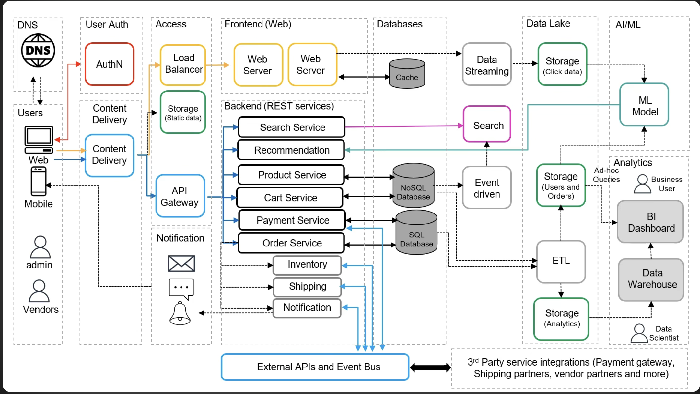

# meCommerce
meCommerce or Mini E-Commerce is a mini project aimed to demonstrate solutions architect principles in a monolithic repository. The idea uses a mock diagram to mimic the internal application of a e-Commerce website would function.


## Running locally

```bash
pip install -r backend/requirements.txt
uvicorn backend.main:app --reload      # run from the repo root
```

Then open **http://localhost:8000** (interactive API docs at **/docs**).

## How it's wired

The frontend is presentation-only and talks to the backend over a REST API —
it holds no product data or pricing of its own. Each backend router maps to a
service box in `mock-diagram.png`:

| Folder                        | Role in the diagram        | Endpoints |
|-------------------------------|----------------------------|-----------|
| `frontend/`                   | Frontend (Web)             | Static `index.html`; calls `/api/*` via `fetch()` |
| `backend/product_service.py`  | Product Service            | `GET /api/products`, `GET /api/products/{id}` |
| `backend/recommendation_service.py` | Recommendation Service | `GET /api/recommendations/{product_id}` |
| `backend/cart_service.py`     | Cart Service               | `GET/POST /api/cart/{cart_id}`, item add/remove |
| `backend/order_service.py`    | Order Service              | `POST /api/orders` (checkout), `GET /api/orders/{id}` |
| `backend/payment_service.py`  | Payment Service            | `POST /api/payments` (mock authorize/capture) |
| `userAuth/auth_service.py`    | User Auth (AuthN)          | `POST /api/users` (register), `POST /api/login` (session token), `GET /api/users/me` (whoami), `GET /api/users` |
| `backend/main.py`             | API Gateway + Web Server   | Mounts the routers and serves the frontend |

Data stores are in-memory for the mock; swap them for the NoSQL / SQL tiers in
the diagram without changing the route contracts. For now everything runs in one
process; each service can later be split into its own deployable behind the
gateway — that's a deployment change, not a code rewrite.

## Auth & sessions

`POST /api/login` verifies a username/password against the salted PBKDF2 hash in
`users.db` and returns a signed session token (a hand-rolled HS256 JWT — see
`userAuth/tokens.py`, standard-library only). The frontend stores it and sends it
as `Authorization: Bearer <token>` on later requests.

The token is **server-authoritative identity**, the same way the cart is
server-authoritative on price: at checkout a valid token's user is written to the
order regardless of any `username` the client sends. Guests (no token) can still
check out. Protect a route by adding the `current_user` dependency (401 without a
valid token) or `optional_user` (works for guests and members alike).

Set `MECOMMERCE_SECRET` to sign tokens in any real deployment — the built-in dev
fallback is public, so tokens signed with it are forgeable.

Seeded demo logins (from `userAuth/auth_service.py`): `aiko`/`matcha123`,
`kenji`/`hojicha`, `admin`/`admin`.
